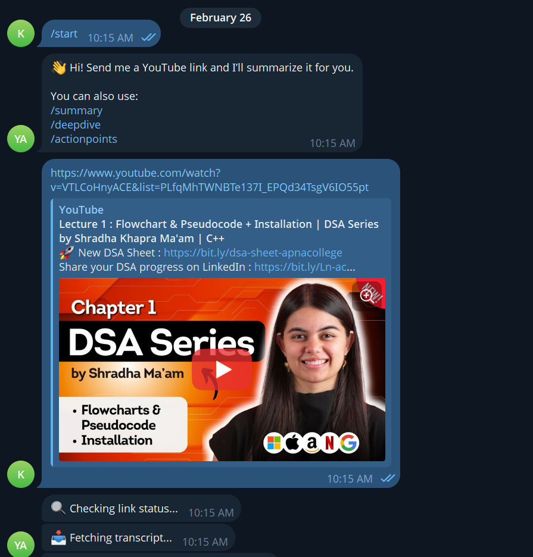
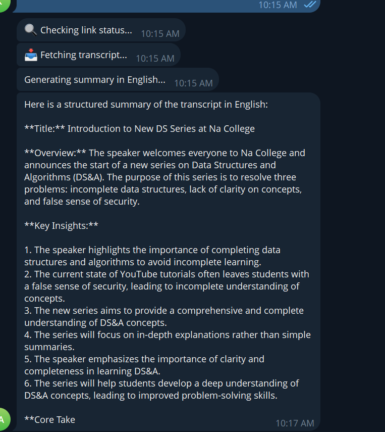
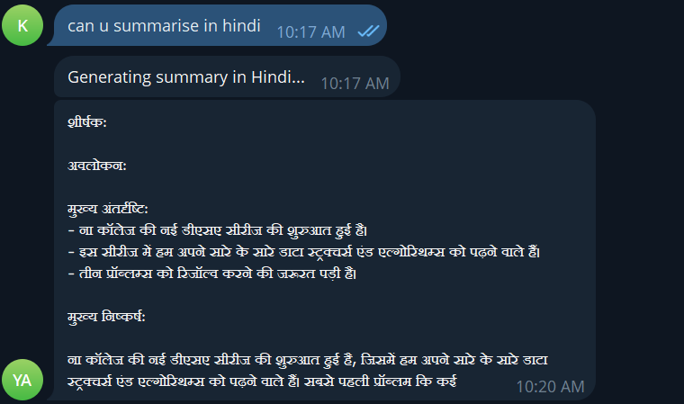
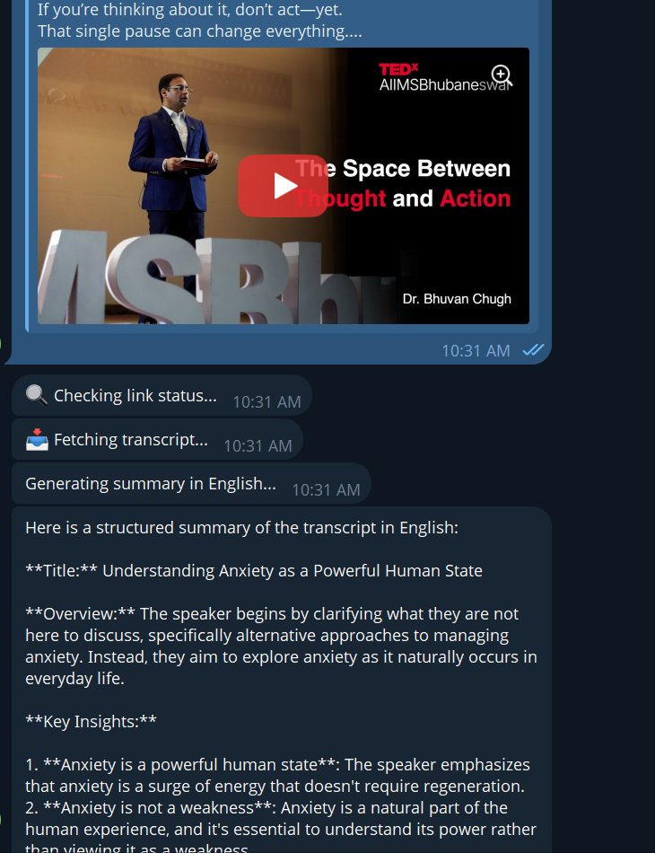
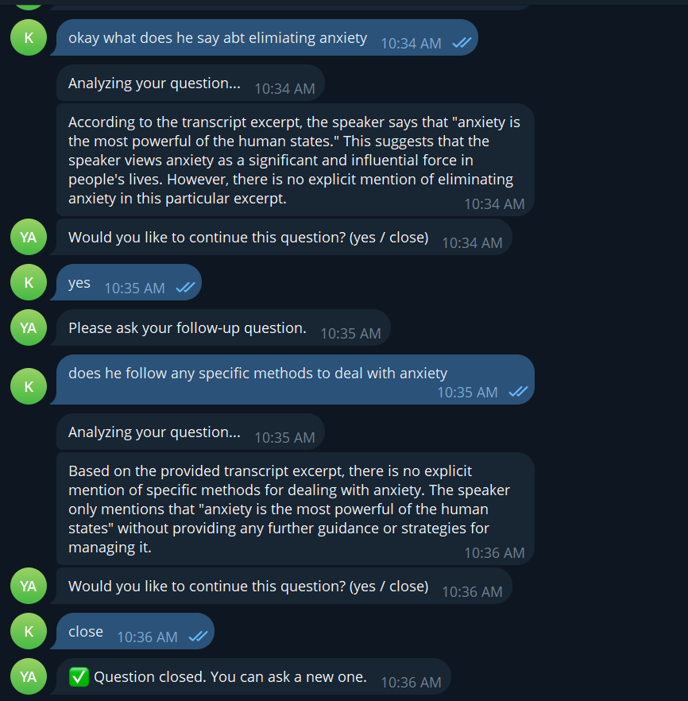
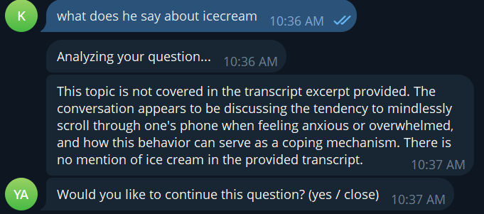
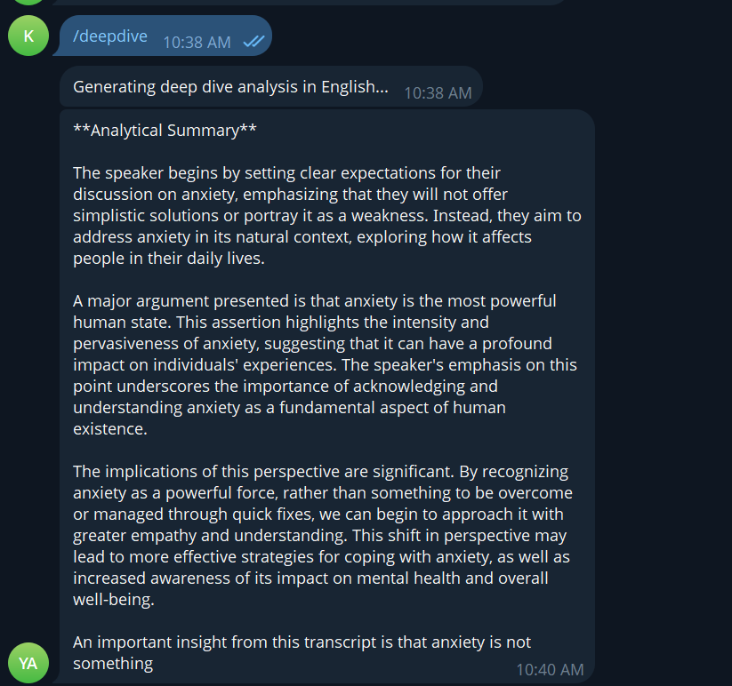
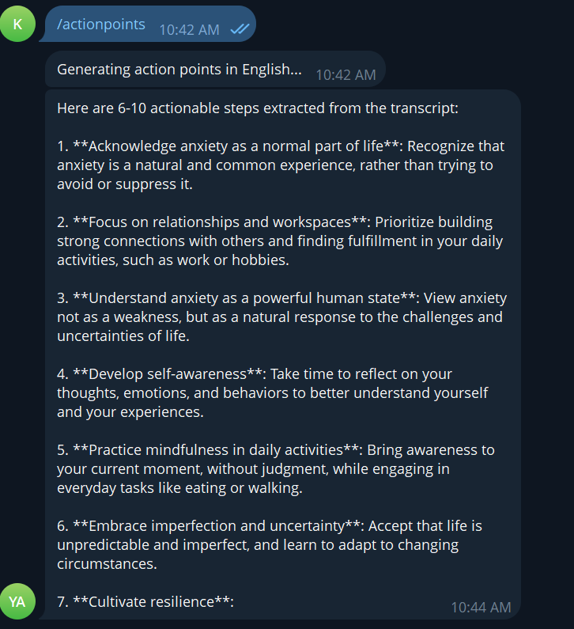

# Telegram YouTube Summarizer & Q&A Bot

A Telegram bot that extracts YouTube transcripts, generates structured multi-language summaries, and lets users ask contextual questions about the video — all powered by a local LLM running through Ollama. No external AI APIs needed.


## What It Does

- Extracts transcripts from YouTube videos using `youtube-transcript-api`
- Generates structured summaries (title, overview, key insights, core takeaway)
- Supports summaries in Hindi, Tamil, Telugu, Malayalam, Spanish, French, and German
- Lets users ask follow-up questions grounded in the transcript
- Keeps sessions isolated per user so multiple people can use it at once
- Offers advanced commands like `/deepdive` and `/actionpoints`


## Demo Screenshots

**1. Starting the bot and sending a YouTube link**


**2. Generating a structured summary with non-English transcript (English output)**


**3. Generating a structured summary (Hindi output)**


**4. Generating a structured summary with English transcript (English output)**


**5. Contextual Q&A session (grounded in transcript)**


**6. Handling unrelated questions (Topic not covered)**


**7. In-depth analytical breakdown (/deepdive)**


**8. Practical actionable steps (/actionpoints)**



## Features

Transcript extraction: pulls captions from YouTube, including auto-generated ones. It tries a priority list of languages (Hindi, English, Spanish, etc.) and falls back to whatever is available.

Structured summaries: go beyond simple compression. Each one includes a title, an overview, key insights (usually 6 bullet points), and a core takeaway. The idea is to give users actual understanding, not just a shorter version of the video.

Multi-language support: was tricky to get right. Small models tend to default to English even when told otherwise. I ended up using native-language section headers in the prompts (for example, "शीर्षक" instead of "Title" for Hindi) and adding explicit constraints like "DO NOT use a single word of English." More on this in the issues section below.

Q&A after summary — once a summary is generated, users can ask questions. The bot finds the most relevant chunk of transcript using keyword overlap and generates an answer grounded in that content. It keeps the last 2 conversation turns for context, and users control the lifecycle with "yes" (continue) or "close" (terminate the q).

Commands:

- `/start` — welcome message and instructions
- `/summary` — regenerate the summary from the stored transcript
- `/deepdive` — detailed analytical breakdown
- `/actionpoints` — extract practical, actionable steps


## Setup

**1. Clone and set up the environment**

bash
git clone <repository-url>
cd telegram-youtube-bot
python -m venv venv
venv\Scripts\activate        # Windows


**2. Install Ollama**

Download from [ollama.com](https://ollama.com), then pull the model:

```bash
ollama pull gemma:2b
```

I went with llama3 .(i had tried mitsral,phi and gemma but each had its own problems , explained below)

**3. Create a `.env` file in the project root**

```env
TELEGRAM_BOT_TOKEN=your_telegram_bot_token
OPENCLAW_BASE_URL=http://localhost:11434
OPENCLAW_MODEL=llama3
```

Get your bot token from [@BotFather](https://t.me/BotFather) on Telegram.

**4. Run**


python -m bot.main


## Architecture

The flow is straightforward:


User sends YouTube URL on Telegram
    -> main.py extracts the video ID (utils.py)
    -> fetches the transcript (transcript_service.py)
    -> sends it to the local LLM via Ollama (summary_service.py)
    -> returns structured output to the user


**`bot/main.py`** handles all Telegram events, command routing, language detection, and per-user session management. Each user gets their own isolated session object with their transcript, conversation history, and Q&A state.

**`bot/summary_service.py`** is the LLM communication layer. It builds prompts, calls Ollama via HTTP, and handles structured summary generation, retrieval-based Q&A, deep dives, and action point extraction. Token output is capped at 200 (`num_predict`) to keep things stable.

**`bot/transcript_service.py`** extracts transcripts from YouTube. It tries a priority list of languages and falls back gracefully if none match.

**`bot/utils.py`** parses YouTube URLs in all formats (standard, short, embed, shorts, live) and extracts the video ID.

**`bot/config.py`** loads environment variables from `.env`.

The dependency flow is one-way: `main.py` imports from the services, services import from `config.py`. No circular dependencies.


## Design Trade-offs

**Local LLM instead of cloud APIs** — no API costs and full offline capability, but inference is slower on CPU and model quality is limited compared to GPT-4 or Gemini.

**Keyword-based retrieval instead of embeddings** — much simpler to implement and doesn't need a vector database, but it's less semantically accurate. A question phrased differently from the transcript might miss the right chunk.

**Token limiting (num_predict: 200)** — keeps responses fast and predictable, but sometimes answers get cut off if the model needs more space.

**In-memory sessions** — easy to implement with zero setup, but everything is lost when the bot restarts. No persistence.

**Transcript truncation (800 chars for summaries)** — prevents prompt explosion and timeouts, but might miss important content near the end of long videos.


## Major Issues I Encountered

### The inference time problem (the biggest one)

Early versions took 5-6 minutes per response. five to six minutes is hugee delay. The bot was technically working but practically unusable.

The causes were stacking on top of each other: no output token limit meant the model would just keep generating, the entire transcript was being stuffed into every prompt, and I was initially using `phi` which is way too incompetent for multilingual support.

I fixed this in stages. First, I added `"num_predict": 200` to hard-cap output length. Then I truncated transcripts to 800 characters for summaries. For Q&A, instead of sending the full transcript, I implemented chunking splitting the transcript into 200-character windows and only sending the most relevant one based on keyword overlap with the question. Finally, I switched from phi to mistral to gemma to llama3, which made the biggest single difference.

Response time went from 5-6 minutes to about 1-1.5 min.

### Model timeouts

Related to the above. Large models on CPU with long prompts would just exceed any reasonable timeout. The solution was the same set of optimizations — smaller model, shorter prompts, token limits, and setting the request timeout to 300 seconds as a safety net.

### Circular import error

At one point I accidentally had `summary_service.py` importing from itself, and some `main.py` logic had leaked into the service layer. The fix was strict module separation: `main.py` only does routing and sessions, each service file does one thing, and dependencies only flow in one direction.

### Multi-language output defaulting to English

This was frustrating. I'd tell the model "reply in Hindi" and it would respond in English anyway. Small models like `gemma:2b` tend to ignore weak language instructions.

What finally worked was a combination of things: using native-language section headers in the prompt template (so the model sees "शीर्षक:" instead of "Title:"), adding aggressive constraints ("CRITICAL: Reply ONLY in Hindi. DO NOT use a single word of English."), providing language-specific fallback messages for the "not covered in video" case, and lowering the temperature to make the model more obedient to instructions.

### Prompt explosion from follow-up questions

Each follow-up question was accumulating the full conversation history plus the full transcript, so prompts were getting massive fast. The fix was limiting history to the last 2 turns, using retrieval-based chunking instead of the full transcript, and adding explicit "yes / close" lifecycle control so Q&A sessions don't run indefinitely.


### The "Frozen Bot" (Blocking Event Loop)

I hit a bug where the bot would stop responding to `/start` or new links while it was already generating a summary. Because I was using the synchronous `requests` library inside `async` handlers, the entire bot was "freezing" until the model finished its work (which could take a minute on CPU).

I fixed this by refactoring the entire core to be fully asynchronous. I switched from `requests` to `httpx.AsyncClient` for LLM calls and implemented **Response Streaming**. Now, the bot stays "alive" and responsive at all times, and it starts typing the summary in Telegram word-by-word as chunks arrive from the model. This significantly improved the perceived speed and user experience.


## Limitations

- Depends on YouTube having captions available — no captions means no transcript
- Sessions are in-memory only, lost on restart

- Transcript truncation may miss content from long videos
- Output quality depends on the local model and hardware


## Future Improvements

- Persistent sessions via SQLite
- Embedding-based semantic retrieval for better Q&A accuracy
- Async LLM calls for concurrency
- GPU support for faster inference
- Cloud deployment for 24/7 availability


## Project Structure

```
telegram-youtube-bot/
  bot/
    __init__.py
    config.py                # env variable loader
    main.py                  # telegram bot entry point, routing, sessions
    summary_service.py       # LLM prompts and communication
    transcript_service.py    # YouTube transcript extraction
    utils.py                 # URL parsing utilities
  .env                       # environment variables (not committed)
  .gitignore
  requirements.txt
  README.md
```


## What I Learned

Building this project gave me hands-on experience with LLM integration over HTTP, prompt engineering (especially for small models that don't follow instructions well), a lightweight version of retrieval-augmented generation, Telegram Bot API patterns, multi-language handling with constrained prompts, managing per-user session state, and performance tuning when your hardware is the bottleneck. The biggest takeaway was that useful AI applications don't require expensive cloud APIs or GPU infrastructure ,you just have to design around your constraints.
